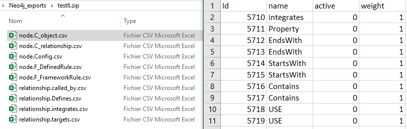

# Friendly Exporter for Neo4j
### Neo4j extension providing a better CSV export than the integrated CSV exporter inside Neo4J



Extension to offer a better CSV export, with one file per label and relationship. 
Making it easier and more understable to edit with a csv editor the output.

## Installation

To use the Friendly exporter you'll have two options:

    - First, build the Java project with Maven. Neo4j needs Java 8 to work correctly, so make sure you have the correct JDK version.
    Once the build is done, you should see a .jar package named 'friendly-neo4j-exporter-%VERSION%*.jar' in the target repository.
    Drag & drop this file into the Neo4j plugin folder ( By default this folder is located at %NEO4J INSTALLATION FOLDER%\neo4j\plugins )

    -Download the latest packaged extension [here](https://github.com/Makunda/Friendly-Neo4j-Exporter/releases), and drop this file into your Neo4j plugin folder.

After this operation, you'll have to restart your Neo4J instance. If you're trying to replace an existing plugin file, you'll have to stop the instance first.

:warning: Don't forget to allow this extension in your Neo4j configuration file. For more information see the [official documentation](https://neo4j.com/docs/operations-manual/4.1/security/securing-extensions/)

## Usage

### Import :

The complete procedure signature and options :
```python
# Save labels to CSV file format
CALL fexporter.save(LabelsToSave, Path, ZipFileName, SaveRelationship, ConsiderNeighbors) 

# Example of use : 
CALL fexporter.save(["C_relationship", "F_FrameworkRule"], "C:/Neo4j_exports/", "Result_05_09_20", true, true )
```

#### With parameters :

    - **@LabelsToSave** - *<String List>* - Labels to save, as a list of string. Ex : ["C_relationship", "F_FrameworkRule"]
    - **@Path** - *<String>* - Location to save output results. Ex : "C:/User/John/Documents/"
    - **@ZipFileName** - *<String>* - Name of the final zip file (the extension .zip will be automatically added). Ex : "Result_05_09_20" 
    - **@SaveRelationship** - *<Boolean> Optional* - Save relationships associated to the labels selected. If the option @ConsiderNeighbors is active, relationships involving neighbors' label will also be saved in the process
    - **@ConsiderNeighbors** - *<Boolean> Optional* - Consider the neighbors of selected labels. If a node in the provided label list has a relationship with another node from a different label, this label will also be saved. 
                                          This option does not necessitate the activation of @SaveRelationship to work, but it is strongly recommended to keep the report consistent.

You can now explore the content of the zip, extract it, and zip it back for re-import.
Each node/relationship saved will have its own associated file.

:warning: **Do not** modificate the values inside the ID column in the node file nor the Source / Destination colums in the relationships file. Those ID are used to rebuilt the graph later. If you modify them, you'll loose the consistency of the graph. 
*The ID displayed are temporary, they will be regenerated for each nodes during the insertion into the database*.

### Export :

```python
# Import back into Neo4K
CALL fexporter.load("C:/exports/output.zip")

# Example of use : 
CALL fexporter.load("C:/Neo4j_exports/config.zip")
```

#### With parameters : 
    - **@PathToZipFileName** - *<String>* - Location to saved output results (in zip format). Ex : "C:/Neo4j_exports/Result_05_09_20.zip"

This way your data will be re-import back into Neo4j.

## TODO
 - Offer the possiblity to select manually which relationship should be exported.
 - Save other nodes labels
 - Implement tests (maybe)

## Contributing
Pull requests are welcome. For major changes, please open an issue first to discuss what you would like to change.
Don't hesitate to propose new functionalities, it's pretty basic for the moment, but it would be great to have a more 'human friendly' exporter than the current integrated to Neo4J. 

## License
[GNU GPL](https://www.gnu.org/licenses/gpl-3.0.html)
